# DeployForge

**DeployForge** is a Java/Spring Boot backend control plane for modelling safe deployment orchestration.

It focuses on the hard backend problems behind release platforms: release intent, artifact evidence, deployment planning, approval gates, locks, canary rollout state, rollback recovery, runtime drift detection, reconciliation, async command execution, runner fencing, and operator recovery.

DeployForge is intentionally backend-first. It does **not** deploy real workloads to Kubernetes, cloud providers, SSH hosts, or CI/CD systems yet. Instead, it proves the control-plane model, safety rules, state transitions, invariants, and recovery flows that a real deployment platform would need before connecting to real executors.

---

## Why DeployForge exists

Most deployment examples are either:

* a basic CRUD app with “deployments” as rows in a table, or
* a full cloud-native tool that hides the backend design behind infrastructure complexity.

DeployForge sits in the middle:

> A production-shaped backend for understanding how deployment orchestration systems model intent, safety, rollout, rollback, drift, repair, and recovery.

The goal is to make the backend design easy to inspect, run, test, and explain.

---

## Current status

DeployForge currently implements a simulated deployment control plane.

Implemented:

* Project, service, and environment modelling
* Release artifact registry
* Artifact evidence and deployability checks
* Deployment plans with idempotency keys
* Promotion evidence and protected environment policy
* Approval workflow
* Deployment locks
* Gate definitions and gate execution
* Readiness evaluation
* Canary rollout state machine
* Rollback recommendations and rollback execution
* Environment current/desired state tracking
* Runtime target registry
* Runtime heartbeat, deployment report, and config report ingestion
* Drift detection and drift lifecycle
* Reconciliation runs, issues, repair plans, and repair intent commands
* Durable async command queue
* Runner registration, heartbeat, lease claiming, fencing, stale completion rejection
* Retry, park, and requeue flows
* Operator recovery APIs
* Consistency verifier and invariant checks
* Docker Compose local runtime
* Integration test proof suite

Not implemented yet:

* Real Kubernetes deployment execution
* Real cloud provider integration
* Real CI/CD runner integration
* Frontend UI
* Full authentication/authorization
* Multi-tenant billing or account model
* Background scheduler loop
* Real external metrics provider integration

---

## Tech stack

| Layer         | Technology                                |
| ------------- | ----------------------------------------- |
| Language      | Java 21                                   |
| Framework     | Spring Boot 3.5.x                         |
| Build         | Maven Wrapper                             |
| API           | Spring Web                                |
| Persistence   | JDBC / JdbcTemplate                       |
| Database      | PostgreSQL                                |
| Migrations    | Flyway                                    |
| Health        | Spring Boot Actuator                      |
| Tests         | JUnit 5, Spring Boot Test, Testcontainers |
| Local runtime | Docker Compose                            |

Design choices:

* JDBC over JPA for explicit SQL and clear state transitions
* Flyway migrations for schema history
* PostgreSQL constraints for safety invariants
* Idempotency keys for safe retries
* Append-style event log for auditability
* Integration tests over excessive mocking
* Modular monolith structure before service decomposition

---

## High-level architecture

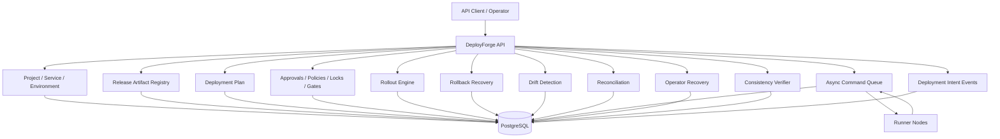

---

## Deployment lifecycle overview

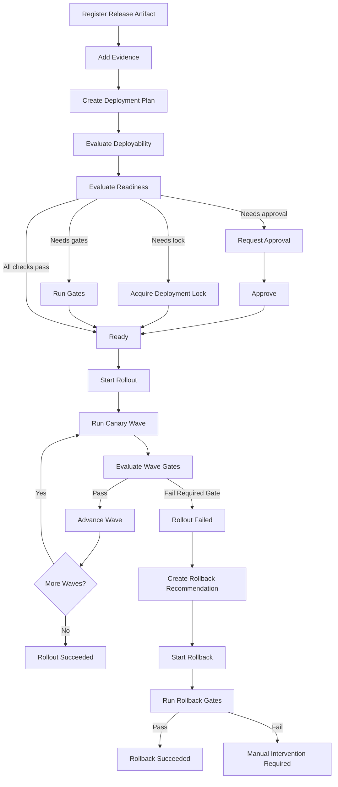

---

## Core domain model

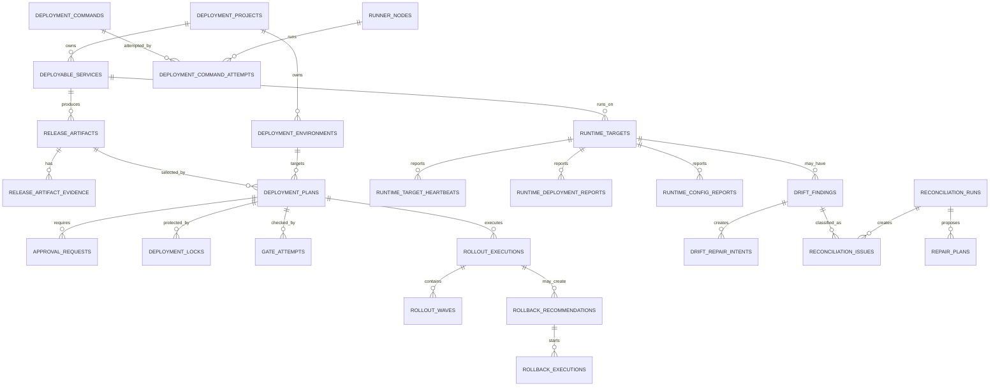

---

## System modules

```text
apps/api/src/main/java/com/deployforge/api
├── approval      # Approval requests and decisions
├── artifact      # Release artifacts, evidence, deployability
├── command       # Durable command queue and command execution adapter
├── drift         # Runtime target reports and desired-vs-actual drift
├── environment   # Deployment environments
├── event         # Deployment intent event log
├── gate          # Gate definitions, attempts, evidence, overrides
├── lock          # Deployment locks and fencing-style lock ownership
├── ops           # Operator recovery and investigation APIs
├── override      # Governance overrides
├── plan          # Deployment plans, risk, idempotency
├── policy        # Protected environment policies
├── project       # Deployment projects
├── promotion     # Promotion rules and promotion evidence
├── readiness     # Deployment readiness evaluation
├── reconcile     # Reconciliation runs, issues, repair plans
├── rollback      # Rollback execution and recovery evidence
├── rollout       # Canary rollout engine and wave state machine
├── runner        # Runner nodes, leases, fencing, command claim/tick
├── service       # Deployable services
├── shared        # API errors, JSONB helpers, shared infrastructure
├── state         # Environment deployment state
└── verify        # Consistency verifier and invariant checks
```

---

## Key concepts

### Release artifact

A release artifact represents something deployable for a service.

It stores:

* version
* git SHA
* image digest
* build number
* source branch
* commit message
* metadata
* readiness status

Artifact identity is immutable. Re-registering the same service/version with the same immutable data is idempotent. Re-registering it with different immutable data is rejected.

---

### Artifact evidence

Evidence proves why an artifact is safe to deploy.

Supported evidence types include:

* build log
* test report
* SBOM
* security scan
* image scan
* changelog
* other

Deployability checks use artifact evidence to decide if the artifact is safe for a target service/environment.

---

### Deployment plan

A deployment plan is release intent.

It answers:

* What service is being deployed?
* Which artifact is being deployed?
* Which environment is targeted?
* Which strategy is used?
* Who requested it?
* Why is it happening?

Deployment plans require an `Idempotency-Key` header. Replaying the same request returns the original plan. Reusing the same key with a different payload returns a conflict.

---

### Readiness

Readiness decides whether a deployment can start.

Readiness checks include:

* artifact deployability
* promotion evidence
* approval status
* gate status
* active deployment lock
* unresolved critical drift

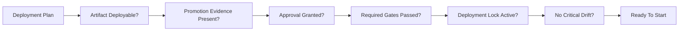

---

### Deployment locks

Deployment locks prevent unsafe concurrent rollout activity for the same target.

A lock records:

* project
* plan
* service
* environment
* owner
* reason
* fencing token
* expiry
* status

Locks are released on successful rollout, rollback success, or abort flows where appropriate.

---

### Gates

Gates model checks that must pass before a deployment can move forward.

Supported gate types include:

* HTTP health checks
* synthetic checks
* metric threshold checks

Gate attempts can pass, fail, time out, be overridden, or be rerun.

---

### Rollout engine

DeployForge models rollout execution as a state machine.

Supported strategies:

* `ALL_AT_ONCE`
* `CANARY`

Canary rollout default wave model:

```text
5% → 25% → 50% → 100%
```

Rollout states include:

* running
* waiting for gates
* paused
* succeeded
* failed
* aborted

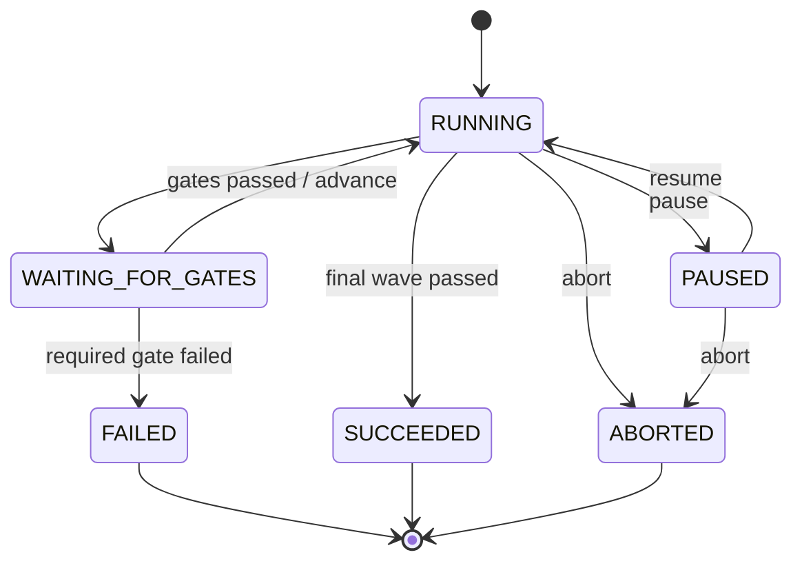

---

### Rollback recovery

A failed rollout can create a rollback recommendation.

Rollback execution:

* starts from an open recommendation
* requires a failed rollout
* may require gates
* updates environment state on success
* records recovery events
* can fail into manual intervention
* can be retried

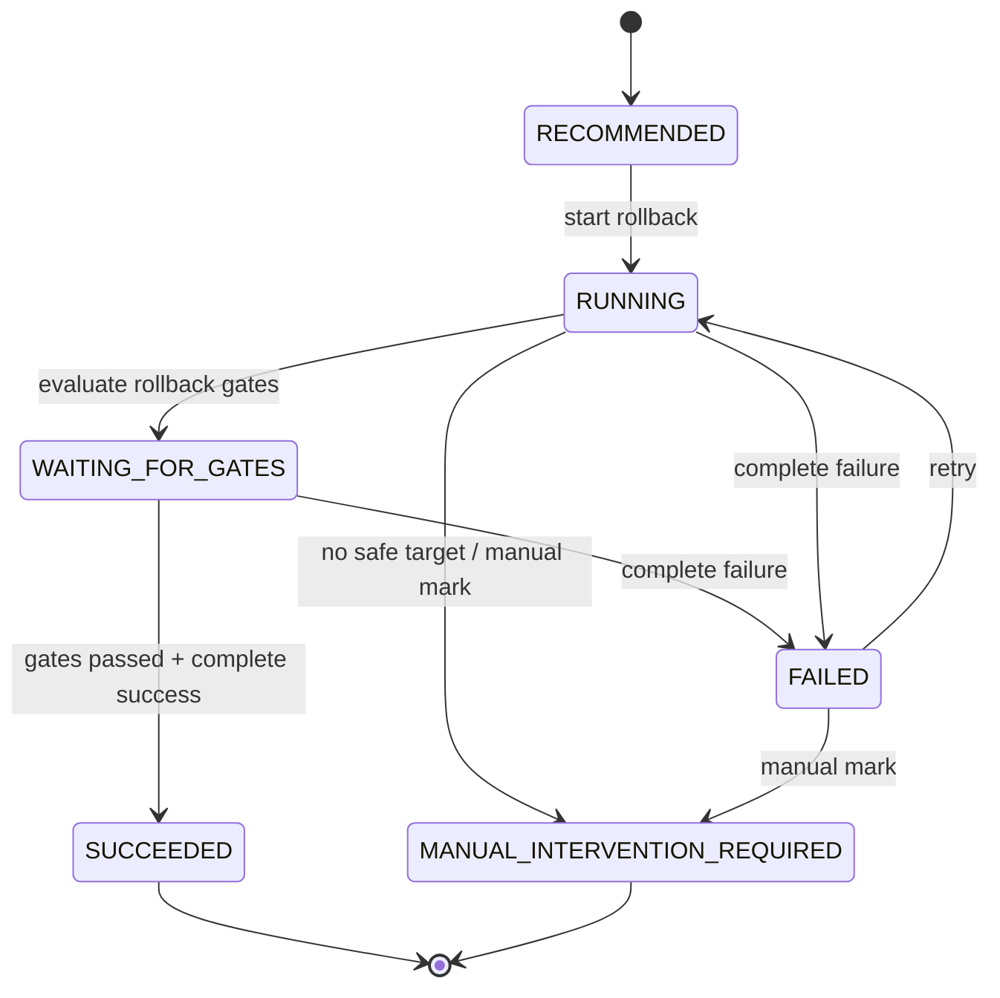

---

### Desired vs actual state

DeployForge tracks both:

* desired environment state
* actual runtime state

Desired state is updated after successful rollout or rollback.

Actual state is reported by runtime targets through:

* heartbeats
* deployment reports
* config reports

Drift detection compares desired and actual state.

---

### Drift detection

DeployForge detects runtime drift such as:

* artifact drift
* manual change
* missing deployment
* config drift
* stale target report
* unknown actual state

Each drift finding includes:

* drift type
* severity
* status
* desired state snapshot
* actual state snapshot
* message
* recommended action

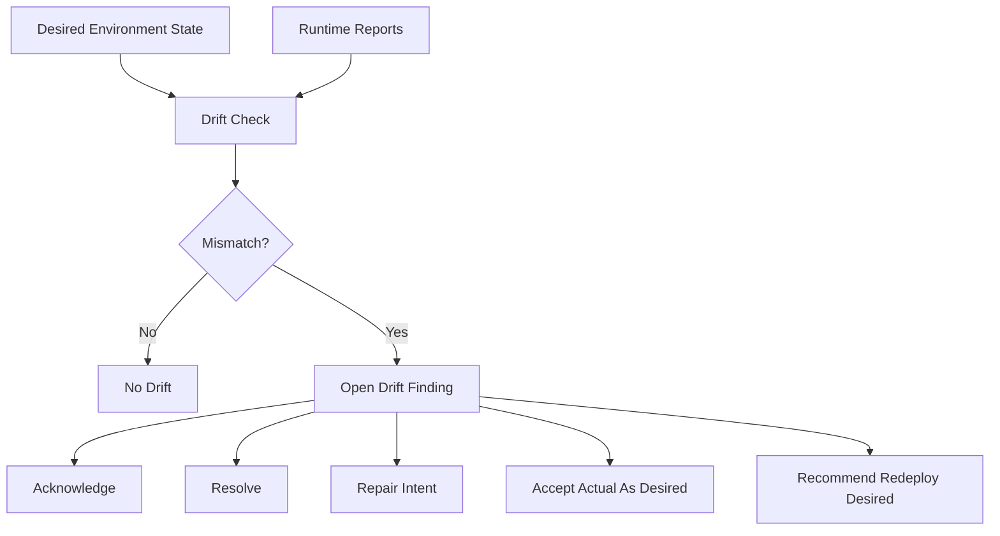

---

### Reconciliation

Reconciliation turns unresolved drift into operational repair work.

A reconciliation run can create:

* reconciliation issues
* repair plans
* repair plan evidence snapshots
* repair intent commands

Repair plans can require approval before execution is recommended.

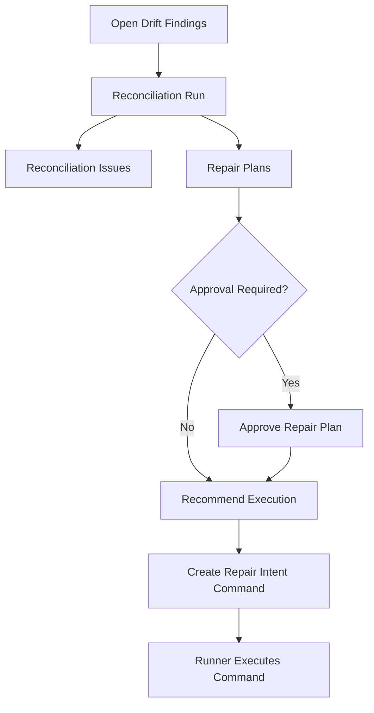

---

### Async command queue

DeployForge has a durable command model for asynchronous orchestration work.

Command types include:

* rollout start
* rollout advance
* rollout pause
* rollout resume
* rollout abort
* rollback start
* rollback complete success
* rollback complete failure
* rollback retry
* drift check
* reconcile environment
* create repair intent
* verify consistency

Commands support:

* idempotent creation
* request hashing
* priority ordering
* max attempts
* retry backoff
* parking
* requeue
* result persistence
* audit events

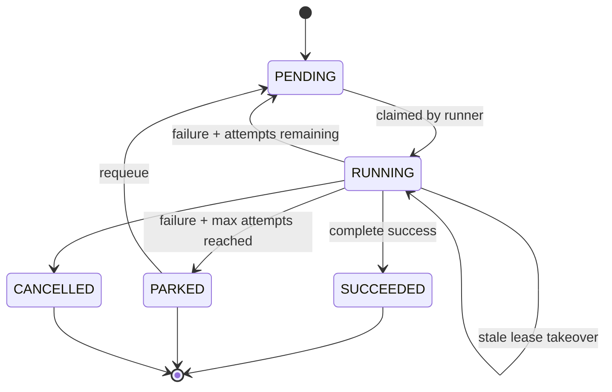

---

### Runner leases and fencing

Runner nodes claim commands using leases and fencing tokens.

This prevents stale workers from corrupting state after another runner takes over the same command.

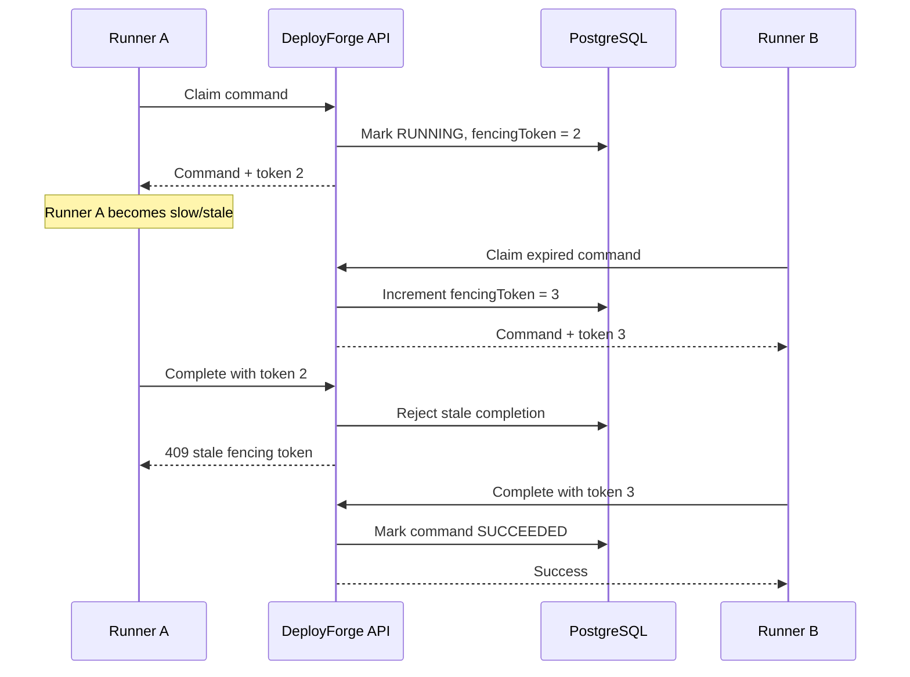

---

### Operator recovery

Operator recovery APIs help inspect and repair stuck operational state.

Supported recovery views/actions include:

* stuck commands
* stuck rollouts
* stuck rollbacks
* stale leases
* stale locks
* operational summary
* investigation view
* recovery evidence bundle
* force park command
* force retry command
* force release stale lease
* manual command resolution

All dangerous operator recovery actions require:

* actor
* reason
* risk acknowledgement

---

### Consistency verifier

DeployForge includes a consistency verifier that checks for broken invariants.

Examples:

* multiple active rollouts for the same service/environment
* multiple active locks for the same service/environment
* failed rollout artifact marked current
* rollback target mismatch
* succeeded rollback not reflected in environment state
* terminal rollout still holding an active lock
* stale runtime target without drift finding
* terminal command still leased
* repair plan execution recommended without approval
* rollback success not reflected in desired state

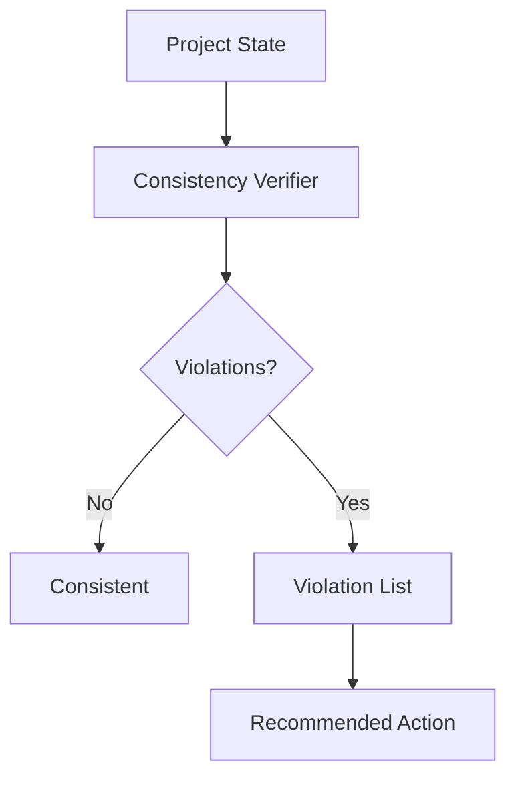

---

## Local quickstart

### Prerequisites

Install:

* Java 21
* Docker Desktop or Docker Engine
* Git

Optional:

* curl
* jq

---

### Clone

```sh
git clone https://github.com/sys-dds/deploy-forge.git
cd deploy-forge
```

---

### Run tests

```sh
cd apps/api
./mvnw test
```

---

### Compile

```sh
cd apps/api
./mvnw -DskipTests compile
```

---

### Validate Docker Compose

```sh
docker compose -f infra/docker-compose/docker-compose.yml config
```

---

### Start locally

```sh
docker compose -f infra/docker-compose/docker-compose.yml up -d --build
```

---

### Check health

```sh
curl http://localhost:8080/actuator/health
curl http://localhost:8080/actuator/health/readiness
curl http://localhost:8080/api/v1/system/ping
curl http://localhost:8080/api/v1/system/node
```

---

### Stop locally

```sh
docker compose -f infra/docker-compose/docker-compose.yml down -v
```

---

## API overview

Base URL:

```text
http://localhost:8080/api/v1
```

Main API groups:

| Area                                           | Example purpose                              |
| ---------------------------------------------- | -------------------------------------------- |
| `/system`                                      | ping and node metadata                       |
| `/projects`                                    | project creation and lookup                  |
| `/projects/{projectId}/services`               | deployable services                          |
| `/projects/{projectId}/environments`           | deployment environments                      |
| `/projects/{projectId}/artifacts`              | release artifact registry                    |
| `/projects/{projectId}/deployment-plans`       | deployment plans                             |
| `/projects/{projectId}/readiness`              | deployment readiness checks                  |
| `/projects/{projectId}/approvals`              | approval workflow                            |
| `/projects/{projectId}/locks`                  | deployment locks                             |
| `/projects/{projectId}/gates`                  | gate definitions and execution               |
| `/projects/{projectId}/rollouts`               | rollout lifecycle                            |
| `/projects/{projectId}/rollbacks`              | rollback lifecycle                           |
| `/projects/{projectId}/runtime-targets`        | runtime target reporting                     |
| `/projects/{projectId}/drift`                  | drift detection and repair intent            |
| `/projects/{projectId}/reconciliation`         | reconciliation and repair plans              |
| `/projects/{projectId}/commands`               | durable command queue                        |
| `/projects/{projectId}/runners`                | runner registration, claim, tick, completion |
| `/projects/{projectId}/operator-recovery`      | recovery and investigation APIs              |
| `/projects/{projectId}/deployment-consistency` | invariant verification                       |
| `/projects/{projectId}/events`                 | deployment intent event log                  |

---

## Example demo flow

This is the conceptual happy path:

```text
1. Create a project
2. Create a service
3. Create dev/staging/prod environments
4. Register a release artifact
5. Add test/security evidence
6. Create a deployment plan with Idempotency-Key
7. Configure protected prod policy
8. Request and approve deployment
9. Acquire deployment lock
10. Run required gates
11. Start canary rollout
12. Evaluate wave gates
13. Advance through waves
14. Mark rollout succeeded
15. Verify environment state and desired state
16. Run consistency verifier
```

Failure path:

```text
1. Start canary rollout
2. Required wave gate fails
3. Rollout becomes FAILED
4. Rollback recommendation is created
5. Start rollback
6. Run rollback gates
7. Complete rollback success
8. Desired/current state return to stable artifact
9. Recovery timeline and consistency verifier prove clean state
```

Drift path:

```text
1. Runtime target reports actual artifact/config
2. Desired state differs from actual state
3. Drift check opens finding
4. Reconciliation run creates issue + repair plan
5. Repair plan is approved
6. Execution recommendation creates repair intent command
7. Runner executes command
8. Drift is resolved or accepted as desired
```

---

## Testing strategy

DeployForge favours integration tests because most of the value is in database-backed state transitions.

The tests cover:

* Flyway migrations
* project/service/environment foundation
* artifact registry and immutability
* evidence and deployability
* deployment plan idempotency
* governance, approvals, locks, and gates
* readiness evaluation
* rollout wave state machine
* rollback lifecycle
* environment state consistency
* drift detection
* reconciliation and repair plans
* async command queue
* runner leases and fencing
* retry, parking, and requeue
* operator recovery
* final lifecycle proof flows
* consistency verifier invariants

Run all tests:

```sh
cd apps/api
./mvnw test
```

Run workflow-style integration tests:

```sh
cd apps/api
./mvnw "-Dtest=*IntegrationTest,*IntegrationTests" test
```

Compile only:

```sh
cd apps/api
./mvnw -DskipTests compile
```

---

## CI

GitHub Actions runs backend hardening checks on pull requests and pushes to `main`.

Current workflow includes:

* checkout
* Java 21 setup
* targeted backend integration tests
* compile
* Docker Compose config validation

Recommended future CI improvements:

* cache Maven dependencies
* upload test reports
* run Docker runtime smoke test in CI
* publish OpenAPI artifact
* add dependency vulnerability scan
* add branch protection requiring the workflow

---

## Docker runtime

The local Docker Compose stack starts:

* PostgreSQL 17 Alpine
* DeployForge API

The API waits for PostgreSQL health before starting.

Health endpoints:

```text
GET /actuator/health
GET /actuator/health/readiness
GET /api/v1/system/ping
GET /api/v1/system/node
```

---

## Configuration

Common environment variables:

| Variable                                       | Default                                        | Purpose                        |
| ---------------------------------------------- | ---------------------------------------------- | ------------------------------ |
| `DEPLOYFORGE_DB_URL`                           | `jdbc:postgresql://localhost:5432/deployforge` | PostgreSQL JDBC URL            |
| `DEPLOYFORGE_DB_USER`                          | `deployforge`                                  | Database username              |
| `DEPLOYFORGE_DB_PASSWORD`                      | `deployforge`                                  | Database password              |
| `DEPLOYFORGE_NODE_ID`                          | `local-node-1`                                 | Local node identifier          |
| `DEPLOYFORGE_DRIFT_TARGET_STALE_AFTER_SECONDS` | `300`                                          | Runtime target stale threshold |

---

## Important design decisions

### JDBC over JPA

DeployForge uses JDBC/JdbcTemplate to keep SQL explicit.

This is useful because the project is state-machine heavy. Seeing the exact SQL makes lifecycle transitions easier to reason about, test, and debug.

---

### Idempotency everywhere dangerous

Deployment plans and commands use idempotency keys because deployment systems must survive duplicate client retries.

The pattern:

```text
same key + same payload     → return existing result
same key + different payload → reject with conflict
```

---

### Database constraints as safety rails

The database schema includes uniqueness, foreign keys, status checks, and indexes to make invalid state harder to persist.

Application checks are useful, but database constraints protect against bugs, concurrency, and future code paths.

---

### Append-style event log

DeployForge records deployment intent events for important transitions.

This gives operators and reviewers a timeline of what happened, who did it, and why.

---

### Leases and fencing for async work

Runner leases alone are not enough. A stale runner may still try to complete old work after another runner has taken over.

Fencing tokens solve this:

```text
Only the latest token holder can complete the command.
```

---

### Simulated execution first

DeployForge currently models deployment execution instead of calling real deployment targets.

This is intentional. The project proves the control plane before adding external executors.

Future executors could include:

* Kubernetes
* GitHub Actions
* GitLab CI
* ArgoCD
* SSH
* cloud provider deployment APIs

---

## Limitations

Current limitations:

* No real authentication or authorization layer
* No real external deployment executor
* No frontend dashboard
* No background scheduler loop
* No real metrics backend integration
* No multi-region architecture
* No production secret management
* No tenant/account billing model
* Limited pagination/filtering across some list endpoints
* Runner identity model needs a clear global-vs-project scoping decision before production use

These are known gaps, not hidden production claims.

---

## Recommended roadmap

### Phase 1: Packaging and clarity

* Rewrite and maintain README
* Add ADRs
* Add architecture diagrams
* Add OpenAPI / Swagger UI
* Add demo script
* Add example API collection

### Phase 2: API hardening

* Add API key authentication
* Add operator role checks
* Add stronger request validation
* Add pagination
* Add consistent error documentation
* Add idempotency documentation

### Phase 3: Observability

* Add structured logs
* Add Micrometer metrics
* Add command backlog metrics
* Add rollout status metrics
* Add drift finding metrics
* Add reconciliation metrics
* Add Grafana dashboard example

### Phase 4: Real executor boundary

* Define executor SPI
* Keep command queue durable
* Add fake executor for tests
* Add one real executor integration behind an interface
* Add executor timeout and cancellation semantics

### Phase 5: Frontend

* Build operator dashboard
* Show deployment plans
* Show readiness checks
* Show rollout waves
* Show rollback recovery
* Show drift findings
* Show command backlog
* Show consistency verifier results

---

## Suggested ADRs

Recommended docs to add under `docs/adr`:

```text
docs/adr/0001-use-modular-monolith.md
docs/adr/0002-use-jdbc-and-flyway.md
docs/adr/0003-idempotency-key-model.md
docs/adr/0004-deployment-plan-vs-rollout-execution.md
docs/adr/0005-gates-locks-and-readiness.md
docs/adr/0006-runner-leases-and-fencing-tokens.md
docs/adr/0007-drift-detection-and-reconciliation.md
docs/adr/0008-consistency-verifier.md
docs/adr/0009-simulated-execution-before-real-executors.md
```

---

## Interview explanation

A concise way to explain DeployForge:

> DeployForge is a Spring Boot deployment orchestration control plane. It models release artifacts, deployment plans, governance checks, canary rollouts, rollback recovery, runtime drift, reconciliation, async commands, runner leases, fencing tokens, and operator recovery. The focus is correctness and operability before plugging into real deployment executors.

Strong interview topics:

* Why deployment intent is separate from execution
* Why deployment plans need idempotency keys
* How canary rollout state machines work
* How rollback recommendations preserve stable artifacts
* How desired state differs from actual runtime state
* How drift detection feeds reconciliation
* Why async runners need fencing tokens
* Why operator recovery APIs need risk acknowledgements
* Why consistency verifiers are useful in stateful systems
* Why simulated execution is a valid first architecture step

---

## Repository structure

```text
.
├── .github
│   └── workflows
│       └── backend-platform-hardening.yml
├── apps
│   └── api
│       ├── Dockerfile
│       ├── mvnw
│       ├── pom.xml
│       └── src
│           ├── main
│           │   ├── java/com/deployforge/api
│           │   └── resources
│           │       ├── application.yml
│           │       └── db/migration
│           └── test
│               └── java/com/deployforge/api
├── infra
│   └── docker-compose
│       └── docker-compose.yml
└── README.md
```

---

## Development commands

```sh
# Run all tests
cd apps/api
./mvnw test

# Run integration-style tests
./mvnw "-Dtest=*IntegrationTest,*IntegrationTests" test

# Compile only
./mvnw -DskipTests compile

# Validate Compose config
cd ../..
docker compose -f infra/docker-compose/docker-compose.yml config

# Start local stack
docker compose -f infra/docker-compose/docker-compose.yml up -d --build

# Stop local stack
docker compose -f infra/docker-compose/docker-compose.yml down -v
```

---

## Production-readiness checklist

Before using DeployForge as a real deployment platform, add:

* authentication
* authorization
* audit actor validation
* API rate limiting
* request pagination
* OpenAPI schema
* secret management
* metrics and dashboards
* structured logs
* executor abstraction
* real executor implementation
* dead-letter/recovery policy
* backup/restore story
* migration rollback policy
* branch protection and required CI

---

## Project positioning

DeployForge should be understood as:

```text
A backend control-plane foundation for deployment orchestration.
```

Not:

```text
A complete production deployment platform.
```

This distinction matters. The project already proves many of the hard backend concepts, but real production deployment would require secure executor integration, auth, observability, and operational hardening.

---

## License

Add a license before treating this as reusable open-source software.

Recommended options:

* MIT for maximum reuse
* Apache-2.0 for stronger patent language

---

## Summary

DeployForge demonstrates how a serious deployment orchestration backend can be modelled before real infrastructure integration.

The strongest parts are:

* idempotent deployment intent
* release artifact evidence
* protected rollout readiness
* canary wave state machine
* rollback recovery
* desired vs actual state
* drift detection
* reconciliation and repair planning
* durable async command queue
* runner leases and fencing
* operator recovery
* consistency verification

It is designed to be readable, testable, and explainable as a production-shaped backend system.
